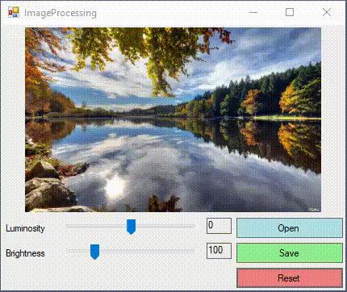

# ImageProcessing

ImageProcessing WinForms can change luminosity and brightness of image and save to file.

The Brightness component can be set to a range of 1.00f to 5.00f.
When the Contrast values goes below 0, you are inverting the Colors making a negative image. You need to decide if you are allowing this behavior. Otherwise, you can limit the Contrast to a minimum of 0.00f: applied to all color components, generates a gray blob (no contrast at all).

The values of the Luminosity component can be set to a range of -1.00f to +1.00f. Above an below you have all-white and all-black results.

Using the identity Matrix as reference:

B = Brightness = 1 : L = Luminosity = 0

    B, 0, 0, 0, 0        1, 0, 0, 0, 0
    0, B, 0, 0, 0        0, 1, 0, 0, 0
    0, 0, B, 0, 0        0, 0, 1, 0, 0
    0, 0, 0, 1, 0        0, 0, 0, 1, 0
    L, L, L, 1, 1        0, 0, 0, 1, 1
(If you are used to the math definition of a Matrix or the way other platforms define it, you may think it's wrong. This is just the way a ColorMatrix is defined in the .Net/GDI dialect).

A sample of the code needed to adjust the Brightness and Contrast of Bitmap, using a ColorMatrix and a standard PictureBox control to present the results.

## Example result

## Procedure

Assign an Image to a PictureBox control, then assign the same Image to a Bitmap object, here a field named adjustBitmap:

    Bitmap adjustBitmap = null; 
Somewhere (Form.Load(), maybe), assign an Image to a PicureBox and a copy of the same Image to the adjustBitmap Field, which will preserve the original Image color values.
Note: Dispose() of the adjustBitmap object when the Form closes (Form.FormClosed) event.

Add 2 TrackBar controls, one to adjust the Brightness and one for the Contrast (named trkContrast and trkBrightness here).

- The Luminosity trackbar will have: Minimum = -100, Maximum = 100, Value = 0
- The Brightness trackbar will have: Minimum = 1, Maximum = 500, Value = 100

Subscribe to and assign to both the same event handler for the Scroll event.
The handler code calls the method responsible for adjusting the Bitmap's Brigthness and Luminosity, using the current values of the 2 TrackBar controls and the reference of the original Bitmap:

    // Somewhere... assign the Bitmap to be altered to the Field
    adjustBitmap = [Some Bitmap];
    // Use a copy of the above as the PictureBox image
    pictureBox.Image = [A copy of the above];

    private void trackBar_Scroll(object sender, EventArgs e)
    {
        pictureBox.Image?.Dispose();
        pictureBox.Image = AdjustBrightnessContrast(adjustBitmap, trkLuminosity.Value, trkBrightness.Value);
    }
The main method convert the int values of the TrackBars to floats in the ranges previously described and assings then to the Matrix array:
The new ColorMatrix is the assigned to an ImageAttribute class, which is used as parameter in the Graphics.DrawImage method overload that accepts an ImageAttribute.

    public Bitmap AdjustBrightnessLuminosity(Image image, int brightnessValue, int luminosityValue)
        {
            float luminosity = luminosityValue / 100.0f;
            float brightness = brightnessValue / 100.0f;
            var bitmap = new Bitmap(image.Width, image.Height, PixelFormat.Format32bppArgb);

            using (var g = Graphics.FromImage(bitmap))
            using (var attributes = new ImageAttributes())
            {
                float[][] matrix = {
                    new float[] { brightness, 0, 0, 0, 0},
                    new float[] {0, brightness, 0, 0, 0},
                    new float[] {0, 0, brightness, 0, 0},
                    new float[] {0, 0, 0, 1, 0},
                    new float[] {luminosity, luminosity, luminosity, 0, 1}
                };

                ColorMatrix colorMatrix = new ColorMatrix(matrix);
                attributes.SetColorMatrix(colorMatrix);
                g.DrawImage(image, new Rectangle(0, 0, bitmap.Width, bitmap.Height),
                    0, 0, bitmap.Width, bitmap.Height, GraphicsUnit.Pixel, attributes);
                return bitmap;
            }
        }
